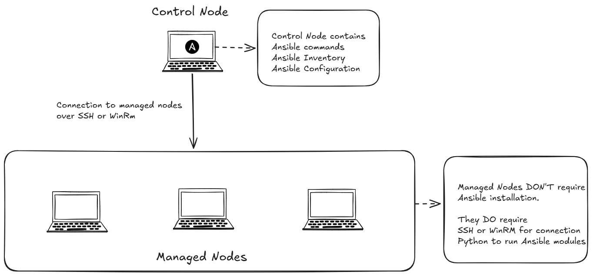
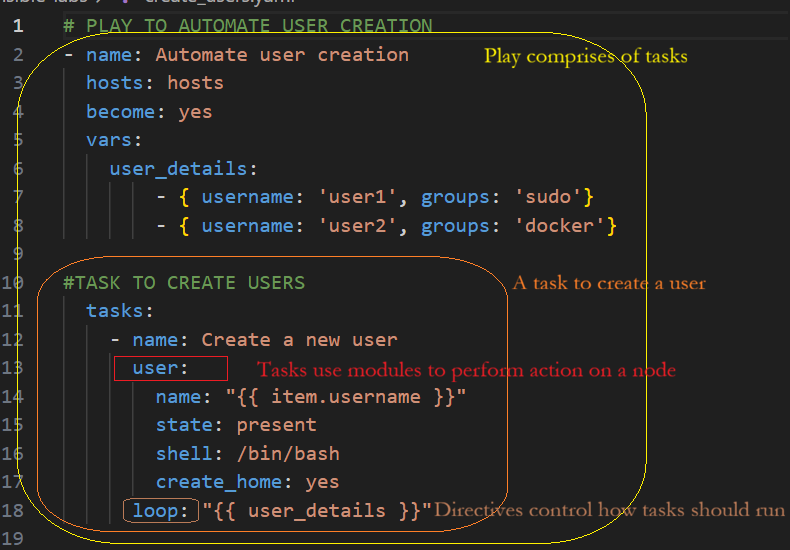

# Ansible


## What is Ansible

Ansible is a configuration management and automation tool that uses simple, human-readable scripts called playbooks to define the desired state of managed systems.

There are various configuration management tools available. Some of these include: [Chef](https://www.chef.io/) and [Puppet](https://www.puppet.com/).

However, what makes Ansible stand out is that it is "agentless": this means it does not require the installation of an "agent" (additional software) on the devices it manages.

It uses remote connections via SSH (on Unix/Linux-based systems) or Windows Remote Management (WinRM) on Windows devices.

## Why use Ansible

Suppose you are a system administrator responsible for managing multiple devices across multiple platforms. How do you maintain these systems or push software updates across all of them?

You can write a custom script on the machines to accomplish this; however, individual management can introduce config drift and errors.

Also, this method is not scalable. For instance, imagine you are responsible for managing hundreds of servers in an enterprise environment; writing scripts to manage that many devices would be infeasible and prone to errors.

Here's where Ansible comes in.

## Ansible Architecture



**Control Node**

A system on which Ansible is installed, and Ansible commands are run to configure **managed nodes.**

**Managed Node**

A remote system, or host, that Ansible controls.

## Basic Terminologies

### Playbooks

Contains instructions, scripts executed by Ansible, to run configurations on remote systems (Nodes). Playbooks are written on the control node and use [YAML syntax](https://docs.ansible.com/projects/ansible/latest/reference_appendices/YAMLSyntax.html).Linux-basedWinRM

A playbook consists of one or more "plays" in an ordered list. Each play contributes to the playbook's overall goal.

Each play consists of **tasks** to execute (executed from top to bottom) and the managed node to target.

### Tasks

A task is an action to be applied to a managed host. This could be: Executing a command, Running a script, or Installing a software package.

### Modules

Modules are the programs Ansible uses to perform actions on managed hosts. Each task in a playbook invokes a module to perform a specific operation, such as installing packages, managing users, copying files, or controlling services.

Most Ansible modules are written to be idempoten&#x74;**.** This means that even if an operation is repeated multiple times, it will always place the system into the same state.

### Directives

Directives are YAML keywords that control how Ansible interprets and runs a playbook. They describe how tasks should run, while modules perform the actual work.

### Ansible Roles

Roles are a standardised way to organise and reuse Ansible automation. A role groups related tasks, variables, and files so that they can be reused across multiple playbooks.

### Ansible Inventory

The inventory defines the hosts that Ansible manages.

It lists the managed devices and allows you to organize them into groups, enabling playbooks to target specific machines based on the group they belong to.

## Example Inventory

**Aprecedingentory**

The Ansible inventory can be written in [YAML](https://en.wikipedia.org/wiki/YAML) or [INI](https://en.wikipedia.org/wiki/INI_file) format

**Inventory file in INI format**

```ini
[webservers]
web1 ansible_host=192.168.56.10
web2 ansible_host=192.168.56.11

[dbservers]
db1 ansible_host=192.168.56.20
```

In the above configuration, **\[webservers]** and **\[dbservers]** are groups. Hosts placed under them belong to that group.

**Inventory file in YAML format**

```yaml

all:
  children:
    webservers:
      hosts:
        web1:
          ansible_host: 192.168.56.10
        web2:
          ansible_host: 192.168.56.11

    dbservers:
      hosts:
        db1:
          ansible_host: 192.168.56.20
```

In the preceding YAML file, **all** is the root group, and **children** define subgroups. **hosts** lists the machines in each group

## Playbook Illustrated

**Ansible Playbook**

The image below shows the contents of a playbook used to automate the creation of users on a Linux system.



## Further Learning

This article provides a bird's-eye view of Ansible and its typical use.

For a more detailed course on Ansible, check out this video series: [Ansible 101 with Jeff Geerling](https://www.youtube.com/playlist?list=PL2_OBreMn7FqZkvMYt6ATmgC0KAGGJNAN).

And for hands-on practice, get your hands dirty by trying out these labs: [Ansible Labs](https://github.com/onakorame-dimon/ansible-labs).

**Stay Passionate!** :smiley: :sparkles: :sparkles:
