# Creating an IAM user

In this article, we would discuss. Some jargon surrounding IAM Practical Demonstration on how to create an IAM user.

When you create an AWS account, you register with an email address and you create a password. This account becomes the root user of the AWS account.

This root user has full access to perform any action in the account. Using an account with unrestricted access to perform routine and day-to-day adiministrative task poses a high security risk.

## What is IAM

AWS **Identity and Access Management (IAM)** is an AWS service that helps you manage access to your AWS account and resources.

Any AWS customer can use IAM; the service is offered at no additional charge.

IAM allows you to create users and each individual person who needs access to your AWS account would have their own unique IAM user.

**IAM User**

An IAM user represents a person or service that interacts with AWS. You define the user in your AWS account.

AWS IAM provides both **Authentication** and **Authorization.**

**Authentication** is verifying whether someone is who they say they are because they have the proper credentials to log in.

After logging in, **Authorization** determines which actions you can perform in the account.

**IAM policies**

IAM policies are JSON-based documents that define permissions. IAM policies can also be attached a group of users using **IAM groups**

**IAM groups**

IAM groups are a grouping of IAM users. Instead of creating and attaching multiple policies to individual users, IAM groups allow you to attach a single policy to a group of users who require the same access.

## Tying it all together

IAM user , IAM Group

Auth ---------- Auth

## Why create an IAM user when I need administrator privileges? Can’t I just use the root user?

Some task require administrator-level access, and you might be tempted to use the root user, but using the root user for everyday tasks is risky. Root credentials are too powerful, and you shouldn't be sharing the root username and password across tools or people.

An IAM user with admin credentials also needs strong protection — especially MFA — because an IAM user with admin privileges can still cause serious damage if compromised.

The key reason for using an IAM user is control. You can’t attach policies to the root user, but you can to an IAM user. That makes it possible to apply the principle of least privilege — working with only the permissions needed to get a job done, and nothing more.

Now that we have explored some basic jargon regarding IAM, let us create an IAM user we can use to administer other IAM users.

## Creating an IAM user

**Step 1**

To create an IAM user for the first time, you need to sign in using your root account. If you don't have an aws account you can simply create one.

click on create account to create a new account

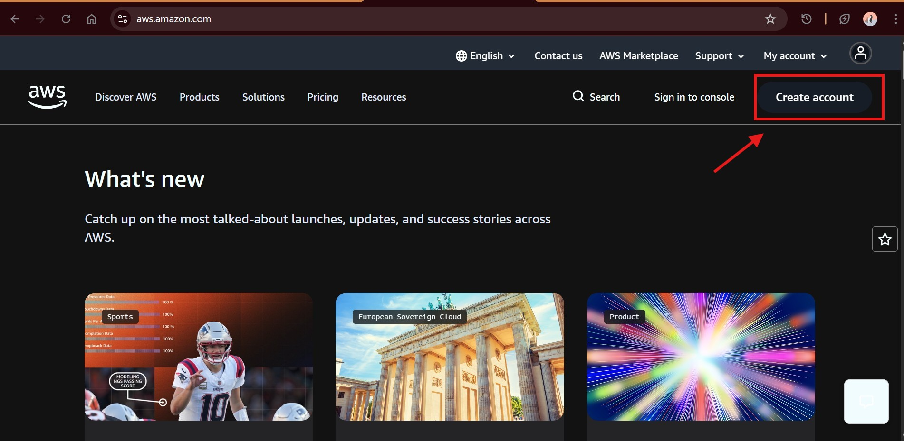

You will then be redirected to the sign up page.

The email address and password used in creating this account becomes the root user credentials.

**Step 2**

Sign in to the aws management console using the newly created or an existing root account.

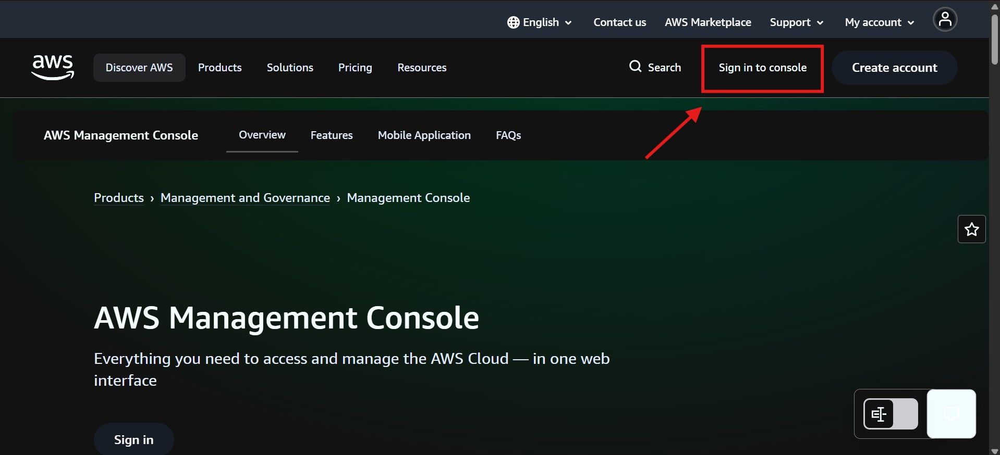

In the sign in page, click Sign in using root user email. Supply the root username and password

Choose the root User account, and input the root account email address.

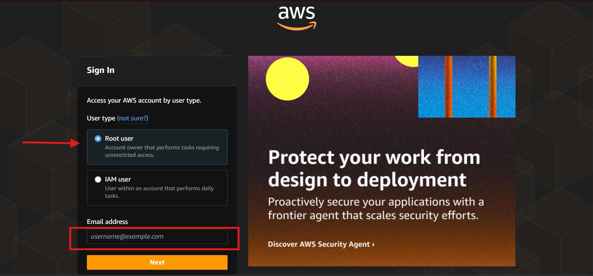

Then, input the root password to sign in.

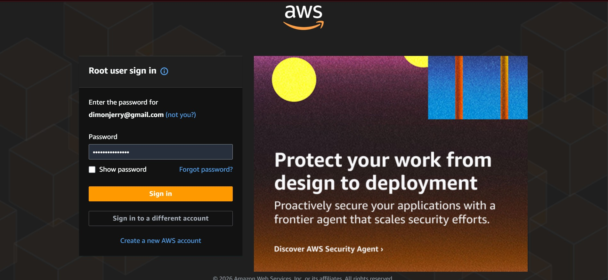

**Step 3**

After signing into the management console, in the search box, search for IAM.

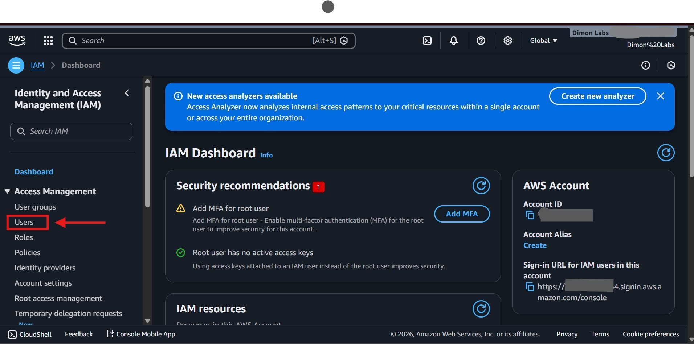

In the IAM dashboard, to create a new user, click on Users.

In the Users panel, click on Create user

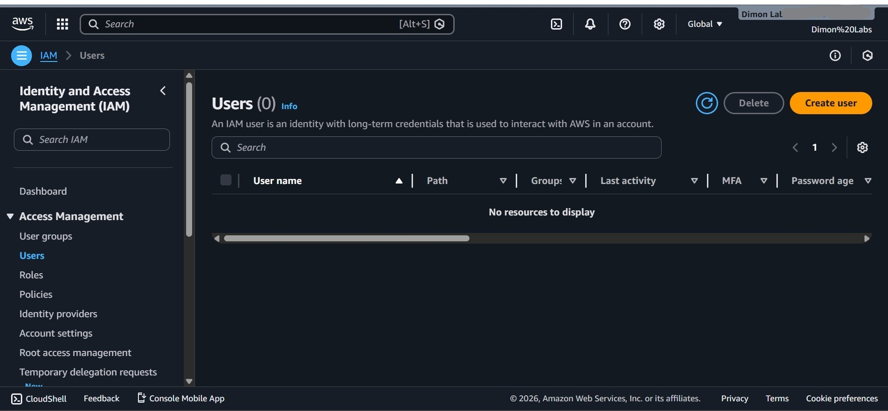

You can then choose a descriptive username for your user.

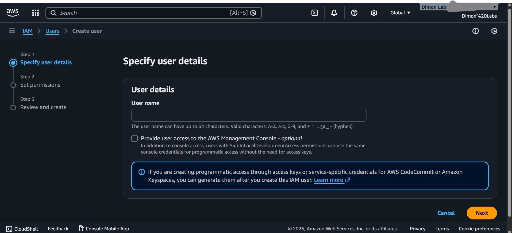

You can also choose to grant console access to the user. This would enable to the IAM user login to the management console using its credentials.

You also have the choice of creating a custom password that the IAM user can use. Or, an auto-generated password that IAM users must change during their first sign-in.

We would use the auto-generated password option.

**Step 4**

**Set user permissions.**

As discussed earlier, IAM policies define what actions an IAM user can perform in the account.

You can attach a policy directly to a user. However, adding a user to a group and letting the user inherit the groups permission is a more efficient way to manage permissions. Therefore, we use this option.

Since we have not created any group, we create a new group.

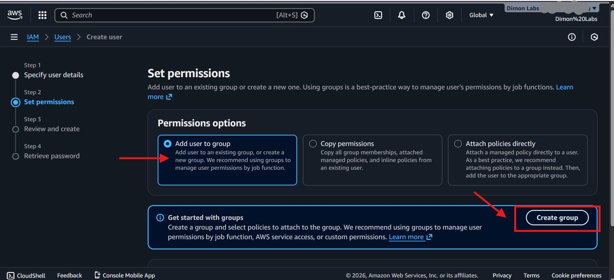

Choose a descriptive user name for your gropu name. In this case, since I want to create an IAM user with adminstrator priviledges, I have chosen the group name: admin.

Next, we attach a policy (which defines the permissions for members of the group.)

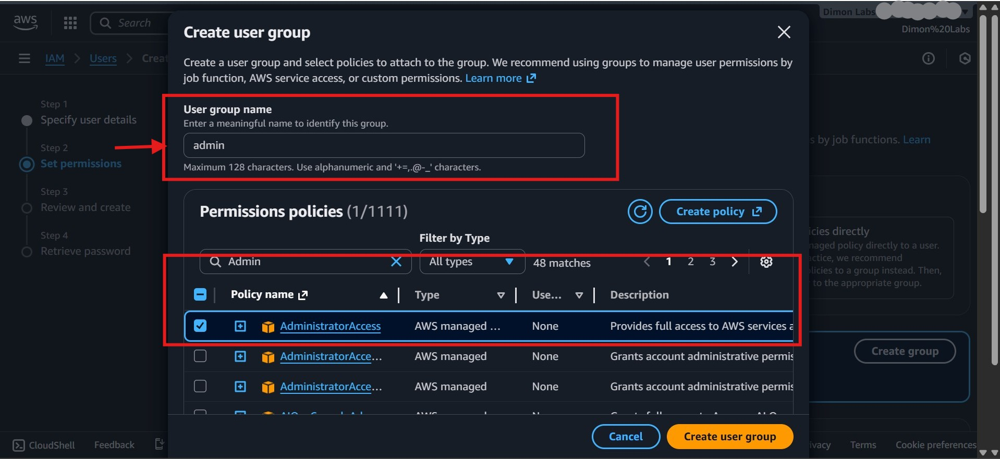

In this scenario, I have used an AWS managed policy. (An AWS managed policy is a policy that is authored and managed by AWS. AWS managed policies are designed to provide permissions for many common use cases) [Find out more about AWS managed policies](https://docs.aws.amazon.com/aws-managed-policy/latest/reference/about-managed-policy-reference.html)

I assigned the Administrator access policy to the group

After the group has been successfully created, add the user to the group by clicking the checkbox.

> NOTE: If you dont click the checkbox to add the user to the group, and create the user. The user would NOT inherit the group permissions.

Next, review your configuration then create the user.

Create the user

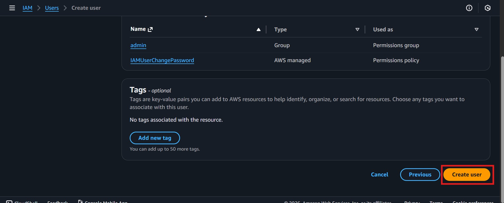

User is successfully created. Remember to copy the password to use for initial sign in.

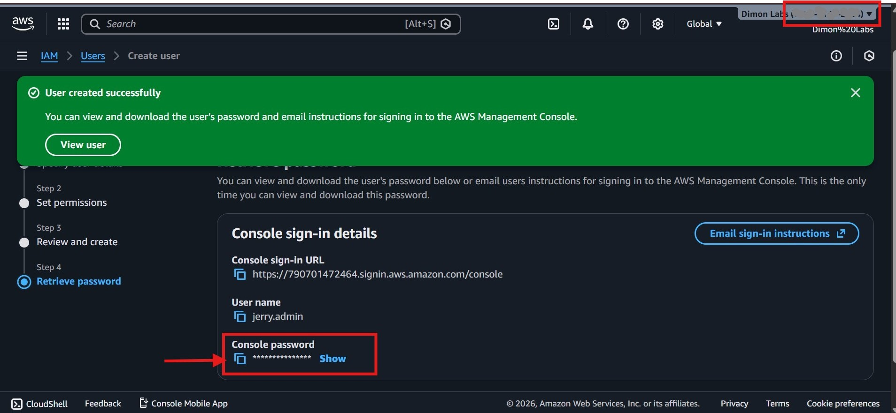

Also, copy the Account ID (The 12 digit number in the form: xxxx-xxxx-xxxx) located at the top right corner of the screen.

While the Account ID's are not secrets or credentials that can be used to access AWS resources, it is best practice not to publicly display them.

**Step 5**

Sign in using IAM user credentials

In the console sign in page, choose sign in with IAM user.

You can refer to **Step 1** to view how to get there.

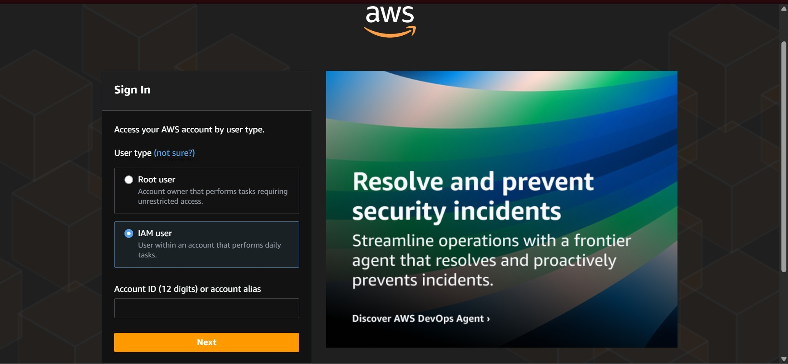

Next, input the 12 Digit Account ID.

> NOTE: If you copied the account ID from the console page, it is displayed as a group of four digits separated by a "-": XXXX-XXXX-XXXX. However, when singin in, remove the "-" separator, and input the twelve digits only. That is in this form: XXXXXXXXXXXX

Input the credentials of the IAM user created. Including the password provided earlier.

After signing in, we are prompted to change our password. This is because of the option we choose when creating the IAM user.

Choose a secure password for the IAM user.

After successfully changing the password, you can then sign in using the IAM user and its associated credentials.

Upon successful sign in, you can access the management console and manage the services you have permissions to access.

We have successfully created an IAM user.

This IAM user has administrator priviledges. You should grant these permissions to only trusted administrators, and you should enforce multi-factor authentication (MFA) for these administrators.

Setting up MFA would be considered in future articles.
