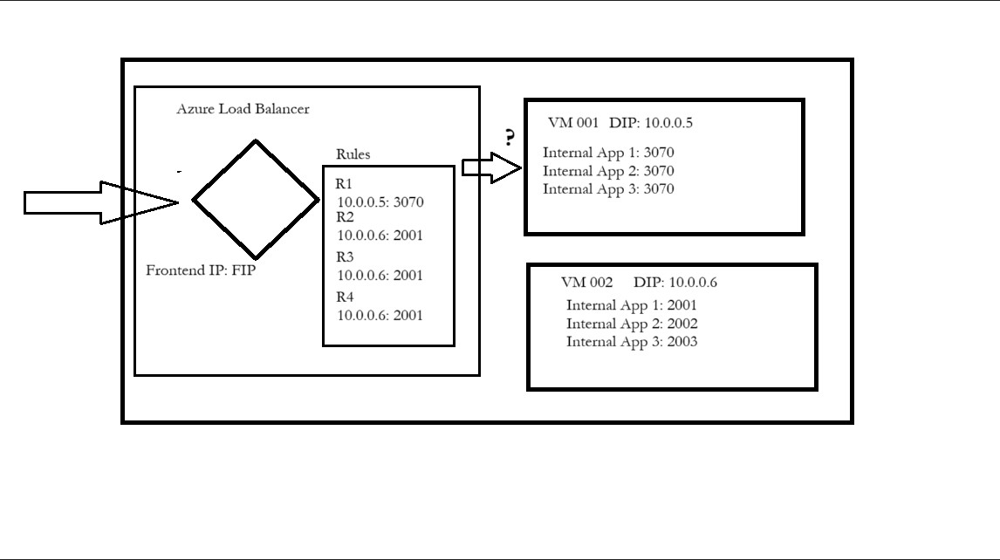

# Azure Load Balancer Floating IP

When I first started learning about Azure load balancer concepts, there was one question that came to mind: why do you need Floating IP when you already have load balancing rules? I wrote this article to assit new Azure network engineers understand the purpose of Azure load balancer floating IP.

## **The Problem**

Some application scenarios prefer or require the use of the same port by multiple application instances on a single VM in the backend pool. Common examples of port reuse include **clustering** for high availability.

**clustering:** Having multiple instances running the same service.

**Problem Scenario:**

Suppose I have clustered an internal App across multiple instances on the same virtual machine, and I am using an Azure load balancer as an ingress into my environment.

For **VM 002,** this is not an issue, because there are multiple ports open for each instance of the Application.

For example, if the Azure Load balancer sends traffic to \_\_VM 002 \_\_ with IP and port combination **10.0.0.6:2002.**

The VM knows to send the traffic to Internal App2, and so on…

However, this is not so for **VM 001.** If the Azure Load Balancer sends traffic with Ip and port combination **10.0.0.5:3070,** which instance of the Internal App would the VM send the traffic to ? Internal App 1, Internal App 2, Internal App 3 ?.

For the VM to decide, the flow has to be unique, there has to be a way for it to use a unique Ip and port combination to determine which Internal App instance to forward the traffic to.

How can we make the flow unique ?

## **The Solution**

The solution is not to create multiple rules

If we try to create multiple load balancing rules, in an aim to accomplish Rule 1 send traffic to Internal App 1, Rule 2 Internal App2… That wouldn't work, because, the load balancer just knows to send traffic to **VM 001 (10.0.0.5:30700)**

* Rule1 10.0.0.5:3070
* Rule2 10.0.0.5:3070
* Rule3 10.0.0.5:3070

It is not aware that there are multiple instances of the same application, it is only the virtual machine that knows that there are multiple instances of the application running. We need to configure the VM itself so that it can send unique flows to each instance of the Application.

Besides, the frontend, protocol and port combination of each load balancing rule and inbound NAT rule on a load balancer **must be unique**, so the configuratin would fail.

## **The Reaaaaaal solution**

You configure floating Ips!

Floating Ips enable you to use the same backend ports across multiple rules, by mapping the same frontend Ip configuration as the backend IP configuration.

In this scenario, rather than configure **VM 001** backend pool to use Ip configuration with IP address: **10.0.0.5**

We configure the backend pool to use an Ip configuration that we create

We then set the Ip address of this newly created Ip configuration to the frontend Ip of the load balancer.

Put simply, what we do is we create loopback interfaces on our virtual machine O.S, and assign these loopback interfaces the frontend Ip address of the load balancer.

What that allows us to do, is to associate/bind our application to these loopback interface addresses.

This in turn allows the O.S to have **a unique way to identify** which Application to route traffic to **given the same port number.**

When configured correctly, if load balancer sends traffic to **VM 001** with Ip and port combination **10.10.10.10:3070,** it knows it is for Internal App 1, and for combination **30.30.30.30:3070,** Internal App 3.

Port reuse is now possible on the same VM by varying the destination IP address.

Your service is exposed to the load balancer by binding it to the frontend’s IP address and port of the respective loopback interface.

## **Put simply:**

**What is floating Ip?**

It is a configuration on Azure Balancer that enables you to reuse the same backend port across multiple load balancing rules.

**NOTE:** When troubleshooting scenarios with floating Ip configured, beware of this limitation:

With Floating IP enabled on a load balancing rule, your application must use the primary IP configuration of the network interface for outbound.

In this scenario, I need to configure my Applications to use **VM 001 DIP: 10.0.0.5** for outbound flows.

This doesn't mean that the client sending the request to the load balancer would see **10.0.0.5!**

This just enables VFP to rewrite the outbound flow from the DIP back to the frontend IP, as it appears outbound works with the primary Ip configuration.

**VFP:** Story for another day!

**Can you make this scenario configuration work !**

